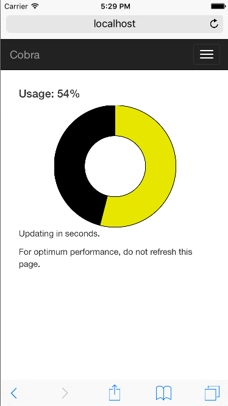

#HSLIDE

### Cobra

Intelligent parking, powered by machine learning.

#HSLIDE

### The Problem

Drivers spend large amounts of time looking for a spot.

- Wastes time of driver
- Increases gas usage
- Adds unnecesary traffic congestion

#HSLIDE

### Introducing Cobra

- Tracks lot usage
- Shows historical data
- Can extrapolate data to future dates
- Intelligently directs drivers to prevent congestion

#HSLIDE

### Seamless Integration

- Operates on HTTPS webhooks
- Simple API
- Supports sister project `DataPoint` for IoT support

#HSLIDE

### Cutting Edge Technology

- Sinatra Ruby
- Google TensorFlow
- Heroku PaaS
- Angular2
- Bootstrap
- Redis-backed caching

#HSLIDE

### Connects to everything

- Transloc
- Simple API
- HTTPS webhooks
- DataPoint

#HSLIDE

### Practical Web Interface

#VSLIDE

### Practical Web Interface

- Tested with Selenium against Android/iOS/Windows/OS X
- Fast
- Responsive